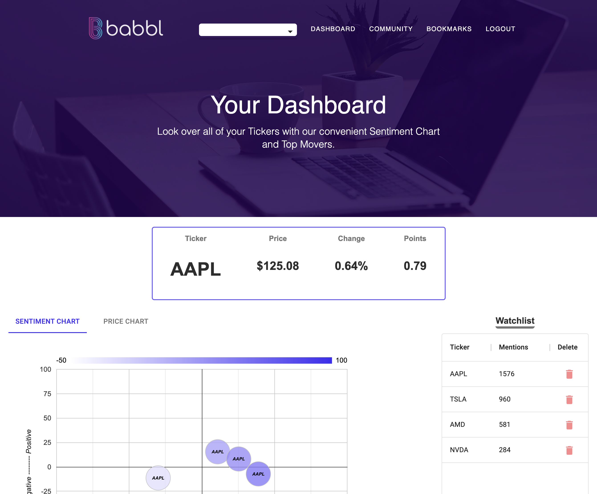
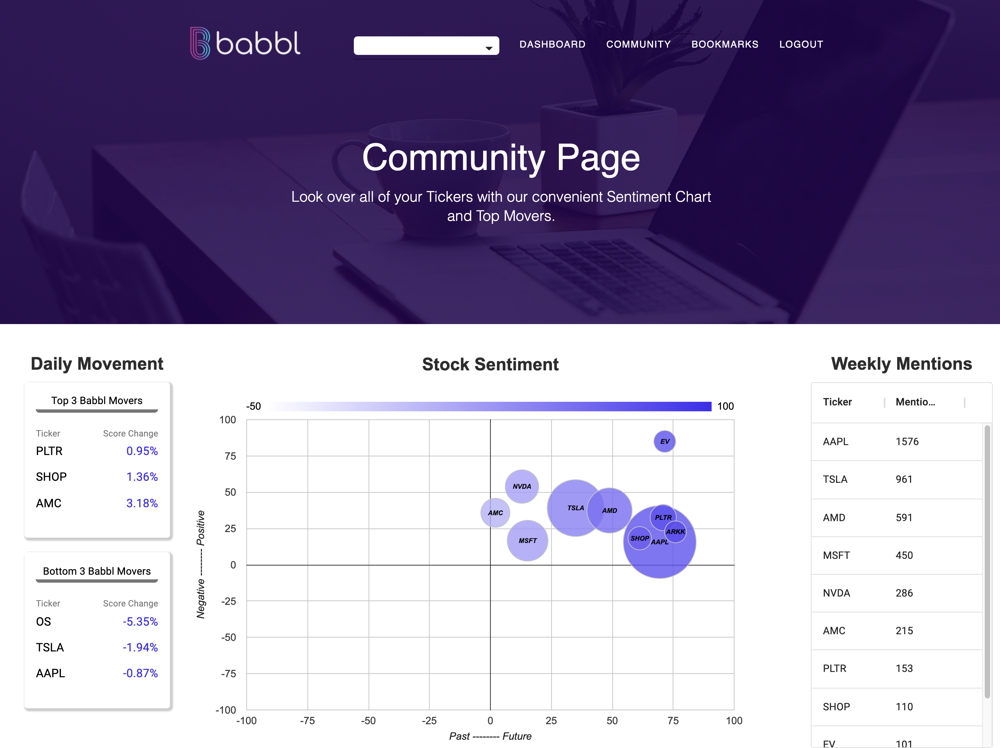
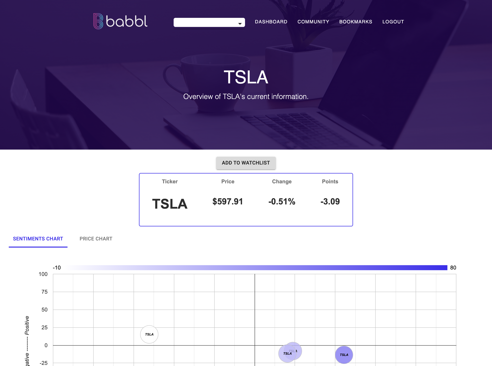
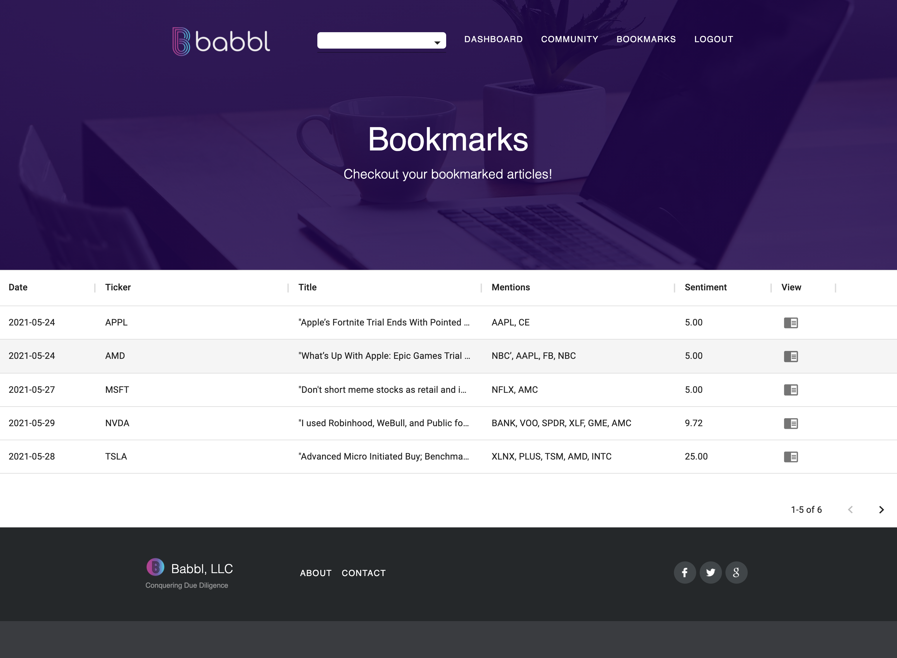
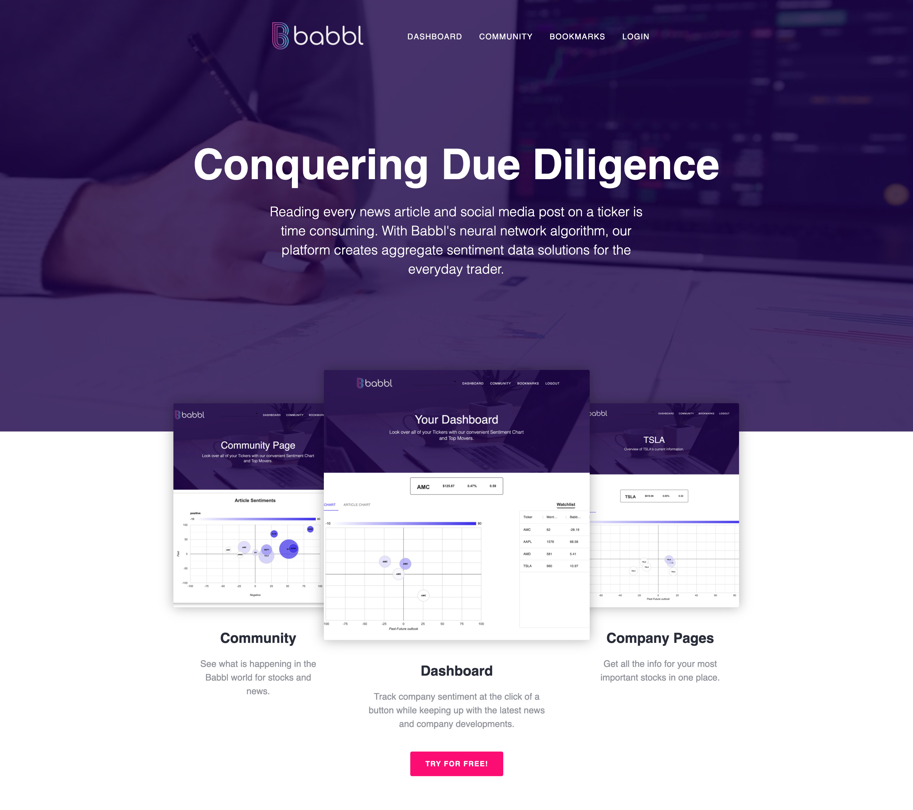

(View Raw will give you the markdown that you can copy to your repos!)

# Babbl 

## Description

_Duration: 3 Week Sprint_

Babbl is here to synthesize financial news and provide users with an easy to digest ‘babbl score’ that lets users understand the future and current sentiments of stocks and cryptocurrencies based on financial news articles. Babbl allows the general public to see the stocks with the most positive and negative forward looking sentiments. In addition they are given access to the stocks that have received the most recent mentions, babbl specific metrics on financial articles and key snippets pertaining to the forward looking sentiments. Babbl members are able to create a watchlist of 10 stocks and see the babbl metrics for each article that references their watchlist. They will also be given articles and snippets regarding their watchlist.

To see the fully functional site, please visit: [DEPLOYED VERSION OF APP](www.heroku.com)

## Screen Shot

### Prerequisites

Before you get started, make sure you have the following software installed on your computer:

- [Node.js](https://nodejs.org/en/)
- [PostrgeSQL](https://www.postgresql.org/)
- [Nodemon](https://nodemon.io/)

## Installation

How do you get your application up and running? This is a step by step list for how another developer could get this project up and running. The good target audience in terms of knowledge, would be a fellow Primer from another cohort being able to spin up this project. Note that you do not need a paragraph here to intro Installation. It should be step-by-step.

If your application has secret keys (for example --  Twilio), make sure you tell them how to set that up, both in getting the key and then what to call it in the `.env` file.

1. Create a database named `babbl`,
2. The queries in the `database.sql` file are set up to create all the necessary tables and populate the needed data to allow the application to run correctly. The project is built on [Postgres](https://www.postgresql.org/download/), so you will need to make sure to have that installed. We recommend using Postico to run those queries as that was used to create the queries, 
3. Create .env file and get token from babbl.dev & IEX Cloud
    - BABBL_TOKEN=
    - IEX_CLOUD_API_TOKEN=
4. Open up your editor of choice and run an `npm install`
5. Run `npm run server` in your terminal
6. Run `npm run client` in your terminal
7. The `npm run client` command will open up a new browser tab for you!

## Usage
How to use Babbl:

1. New users will be brought to the landing page which explains Babbl and offers a way to try Babbl through a button that will lead to the community page.

2. The Community page has a sentiment chart that is populated with the top 10 mentioned companies for the week.  Below that are company snippets from all of the top 10 companies.  Below the snippets are new articles from the top 10 companies.

3. The dashboard link in the header will be reserved for users with an account.  This page will look similar to the community page, but have a watchlist that the user can closely watch companies of interest.  The user can add and remove companies from the watchlist.  The ticker, chart, and snippets will all populate with the selected company from the watchlist.  The news articles below will be all news articles from available companies.  The user will be able to sort by company ect.

4. The select menu in the header will allow the user to select a company and go to the company page.  The user will see company specific ticker information, a sentiment chart and price chart, company specific news snippets and general news articles.  A user will be able to add a company to the watchlist from the company page by clicking the add to watchlist button located near the ticker.

## Built With

This application uses the following technologies:

- [React](https://reactjs.org/)
- [Redux](https://maven.apache.org/)
- [Redux-Saga](https://redux-saga.js.org/)
- [Express](https://expressjs.com/)
- [PostgreSQL](https://www.postgresql.org/)
- [Material-UI](https://material-ui.com/)
- [Google-Charts](https://developers.google.com/chart/)

_Note, include this only if you have a license file. GitHub will generate one for you if you want!_

## Acknowledgement
Thanks to all of the staff at [Prime Digital Academy](https://www.primeacademy.io) who equipped us with the skills to make this application a reality, especially our instructor Dev Janna. Thank you to the EMIRP Cohort for the all of the collaboration throughout our group projects during the course.

## Support
If you have serious issues,  contact [Prime Digital Academy](https://www.primeacademy.io)

